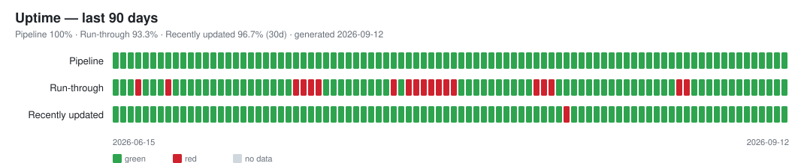

# Uptime

_Last run: **2026-07-12T14:42:12Z**. Auto-generated by `R/uptime.R` (daily GitHub Action). Do not edit by hand._

Three binary daily metrics, one row per day (history in [`data/uptime.csv`](data/uptime.csv)):

- 🟢 **Pipeline** — the daily ETL ran to completion (this is **our** automation; it stays green even when a source is down).
- 🔴 **Run-through (upstream)** — 1 source(s) failed to fetch — **upstream did not deliver** (previous data kept). — **open incident: 4 day(s)**
- 🟢 **Recently updated** — every dataset expected to update is fresh.

| Metric | Uptime 30d | Uptime 90d | Worst incident |
|---|---:|---:|---:|
| Pipeline | 100% | 97.5% | 1 d |
| Run-through (upstream) | 80% | 82.5% | 4 d |
| Recently updated | 100% | 100% | 0 d |

## Current run-through

⏳ 1 source(s) hit a network/provider error this run — **nothing to do on our side** (data preserved). An issue opens only if this persists ≥ 3 days:

- `ch_adecco_sjmi` — Failed to perform HTTP request. Caused by error in `curl::curl_fetch_memory()`: ! Timeout was reached [www.stellenmarktmonitor.uzh.ch]: Failed to connect to www.stellenmarktmonitor.uzh.ch port 443 after 15000 ms: Timeout was reached **— escalated: 4 consecutive days, see `etl-outage` issue**

## Stale datasets

✅ Nothing stale — see the full board in [STATUS.md](STATUS.md).

## Recent history

| Date | Pipeline | Run-through | Recently updated | Skips | Stale |
|---|---|---|---|---:|---:|
| 2026-07-12 | 🟢 | 🔴 | 🟢 | 1 | 0 |
| 2026-07-11 | 🟢 | 🔴 | 🟢 | 1 | 0 |
| 2026-07-10 | 🟢 | 🔴 | 🟢 | 1 | 0 |
| 2026-07-09 | 🟢 | 🔴 | 🟢 | 1 | 0 |
| 2026-07-08 | 🟢 | 🟢 | 🟢 | 0 | 0 |
| 2026-07-07 | 🟢 | 🟢 | 🟢 | 0 | 0 |
| 2026-07-06 | 🟢 | 🟢 | 🟢 | 0 | 0 |
| 2026-07-05 | 🟢 | 🟢 | 🟢 | 0 | 0 |
| 2026-07-04 | 🟢 | 🟢 | 🟢 | 0 | 0 |
| 2026-07-03 | 🟢 | 🟢 | 🟢 | 0 | 0 |
| 2026-07-02 | 🟢 | 🟢 | 🟢 | 0 | 0 |
| 2026-07-01 | 🟢 | 🟢 | 🟢 | 0 | 0 |
| 2026-06-30 | 🟢 | 🟢 | 🟢 | 0 | 0 |
| 2026-06-29 | 🟢 | 🟢 | 🟢 | 0 | 0 |
| 2026-06-28 | 🟢 | 🟢 | 🟢 | 0 | 0 |
| 2026-06-27 | 🟢 | 🟢 | 🟢 | 0 | 0 |
| 2026-06-26 | 🟢 | 🟢 | 🟢 | 0 | 0 |
| 2026-06-25 | 🟢 | 🟢 | 🟢 | 0 | 0 |
| 2026-06-24 | 🟢 | 🟢 | 🟢 | 0 | 0 |
| 2026-06-23 | 🟢 | 🟢 | 🟢 | 0 | 0 |
| 2026-06-22 | 🟢 | 🔴 | 🟢 | 1 | 0 |
| 2026-06-21 | 🟢 | 🟢 | 🟢 | 0 | 0 |
| 2026-06-20 | 🟢 | 🟢 | 🟢 | 0 | 0 |
| 2026-06-19 | 🟢 | 🟢 | 🟢 | 0 | 0 |
| 2026-06-18 | 🟢 | 🔴 | 🟢 | 12 | 0 |
| 2026-06-17 | 🟢 | 🟢 | 🟢 | 0 | 0 |
| 2026-06-16 | 🟢 | 🟢 | 🟢 | 0 | 0 |
| 2026-06-15 | 🟢 | 🟢 | 🟢 | 0 | 0 |
| 2026-06-14 | 🟢 | 🟢 | 🟢 | 0 | 0 |
| 2026-06-13 | 🟢 | 🟢 | 🟢 | 0 | 0 |
