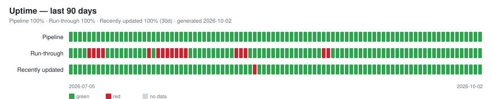

# Uptime

_Last run: **2026-10-04T10:19:50Z**. Auto-generated by `R/uptime.R` (daily GitHub Action). Do not edit by hand._

Three binary daily metrics, one row per day (history in [`data/uptime.csv`](data/uptime.csv)):

- 🟢 **Pipeline** — the daily ETL ran to completion (this is **our** automation; it stays green even when a source is down).
- 🟢 **Run-through (upstream)** — every source fetched cleanly this run.
- 🟢 **Recently updated** — every dataset expected to update is fresh.

| Metric | Uptime 30d | Uptime 90d | Worst incident |
|---|---:|---:|---:|
| Pipeline | 100% | 100% | 1 d |
| Run-through (upstream) | 100% | 81.1% | 7 d |
| Recently updated | 100% | 98.9% | 1 d |

## Current run-through

✅ Clean run-through — every source fetched and validated.

## Stale datasets

✅ Nothing stale — see the full board in [STATUS.md](STATUS.md).

## Recent history

| Date | Pipeline | Run-through | Recently updated | Skips | Stale |
|---|---|---|---|---:|---:|
| 2026-10-04 | 🟢 | 🟢 | 🟢 | 0 | 0 |
| 2026-10-03 | 🟢 | 🟢 | 🟢 | 0 | 0 |
| 2026-10-02 | 🟢 | 🟢 | 🟢 | 0 | 0 |
| 2026-10-01 | 🟢 | 🟢 | 🟢 | 0 | 0 |
| 2026-09-30 | 🟢 | 🟢 | 🟢 | 0 | 0 |
| 2026-09-29 | 🟢 | 🟢 | 🟢 | 0 | 0 |
| 2026-09-28 | 🟢 | 🟢 | 🟢 | 0 | 0 |
| 2026-09-27 | 🟢 | 🟢 | 🟢 | 0 | 0 |
| 2026-09-26 | 🟢 | 🟢 | 🟢 | 0 | 0 |
| 2026-09-25 | 🟢 | 🟢 | 🟢 | 0 | 0 |
| 2026-09-24 | 🟢 | 🟢 | 🟢 | 0 | 0 |
| 2026-09-23 | 🟢 | 🟢 | 🟢 | 0 | 0 |
| 2026-09-22 | 🟢 | 🟢 | 🟢 | 0 | 0 |
| 2026-09-21 | 🟢 | 🟢 | 🟢 | 0 | 0 |
| 2026-09-20 | 🟢 | 🟢 | 🟢 | 0 | 0 |
| 2026-09-19 | 🟢 | 🟢 | 🟢 | 0 | 0 |
| 2026-09-18 | 🟢 | 🟢 | 🟢 | 0 | 0 |
| 2026-09-17 | 🟢 | 🟢 | 🟢 | 0 | 0 |
| 2026-09-16 | 🟢 | 🟢 | 🟢 | 0 | 0 |
| 2026-09-15 | 🟢 | 🟢 | 🟢 | 0 | 0 |
| 2026-09-14 | 🟢 | 🟢 | 🟢 | 0 | 0 |
| 2026-09-13 | 🟢 | 🟢 | 🟢 | 0 | 0 |
| 2026-09-12 | 🟢 | 🟢 | 🟢 | 0 | 0 |
| 2026-09-11 | 🟢 | 🟢 | 🟢 | 0 | 0 |
| 2026-09-10 | 🟢 | 🟢 | 🟢 | 0 | 0 |
| 2026-09-09 | 🟢 | 🟢 | 🟢 | 0 | 0 |
| 2026-09-08 | 🟢 | 🟢 | 🟢 | 0 | 0 |
| 2026-09-07 | 🟢 | 🟢 | 🟢 | 0 | 0 |
| 2026-09-06 | 🟢 | 🟢 | 🟢 | 0 | 0 |
| 2026-09-05 | 🟢 | 🟢 | 🟢 | 0 | 0 |
